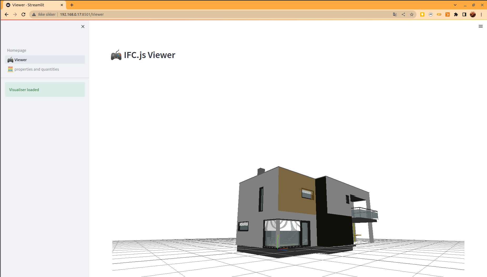
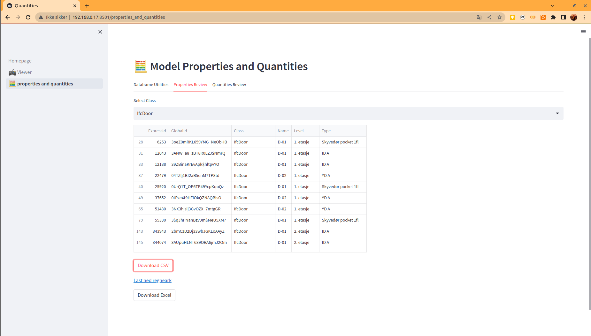

# Generic BIM app template repo

Repo to create a generic BIM app based of [Ifc101 course ep.09 by Sigma Dimensions](https://github.com/myoualid/ifc-101-course)

Currently just slightly changes to the code by Sigma Dimensions. 




Some changes to be able to download csv as a file from browser downloads and select class for viewing properties. 



Serves the purpose of starter code for other streamlit IFC apps 

Run it by 

```streamlit run Homepage.py```
